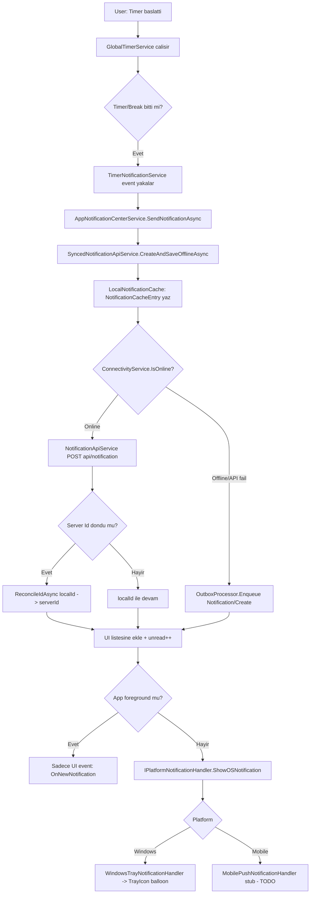
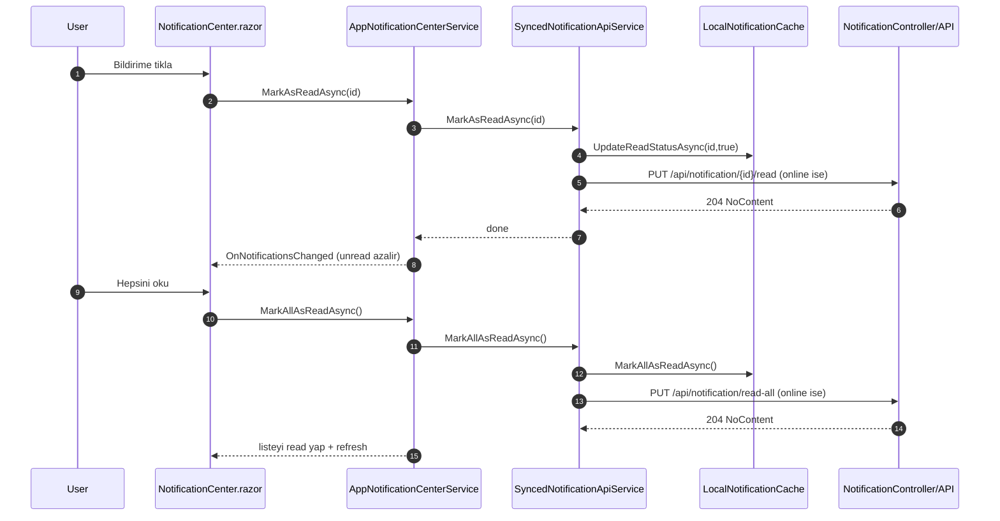
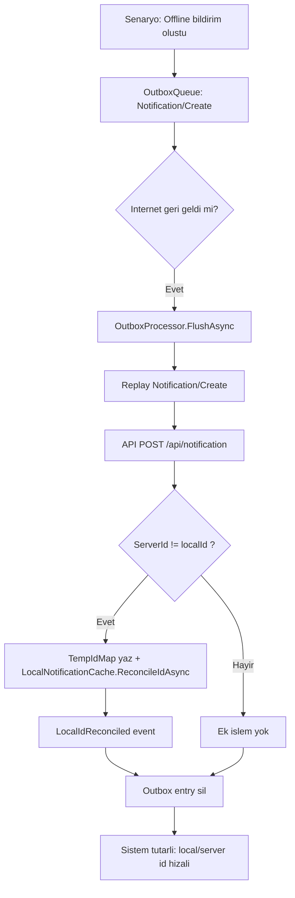

# Notification Flow

Bu dokuman, mevcut bildirim altyapisini kullanici senaryosu bazli akislarla gosterir.

## 1) Timer Bitisinden Bildirim Uretimine Akis

## 2) Bildirimi Okundu Yapma ve Hepsini Okuma

## 3) Offline Outbox Replay ve Id Uzlastirma

